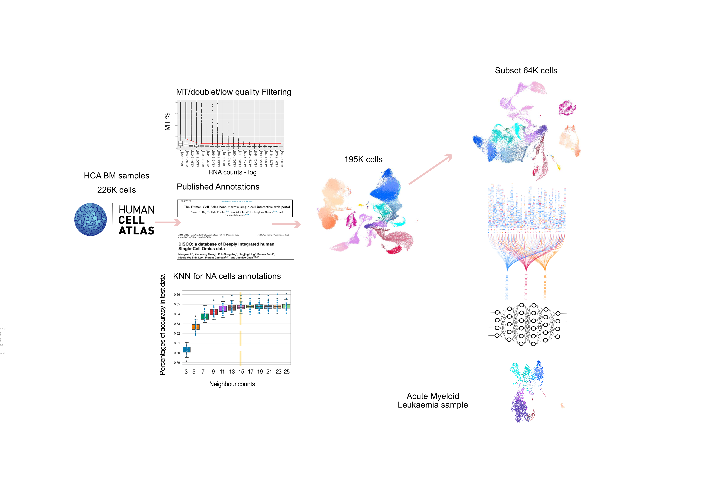
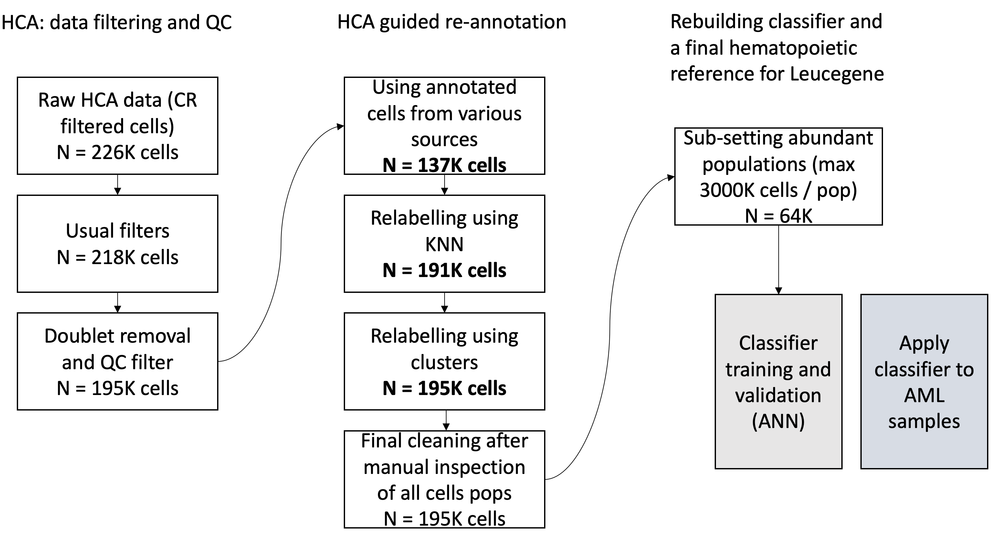
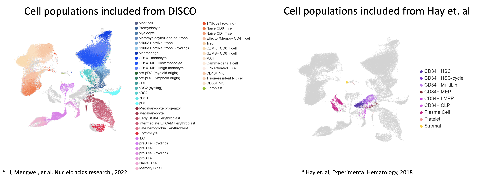
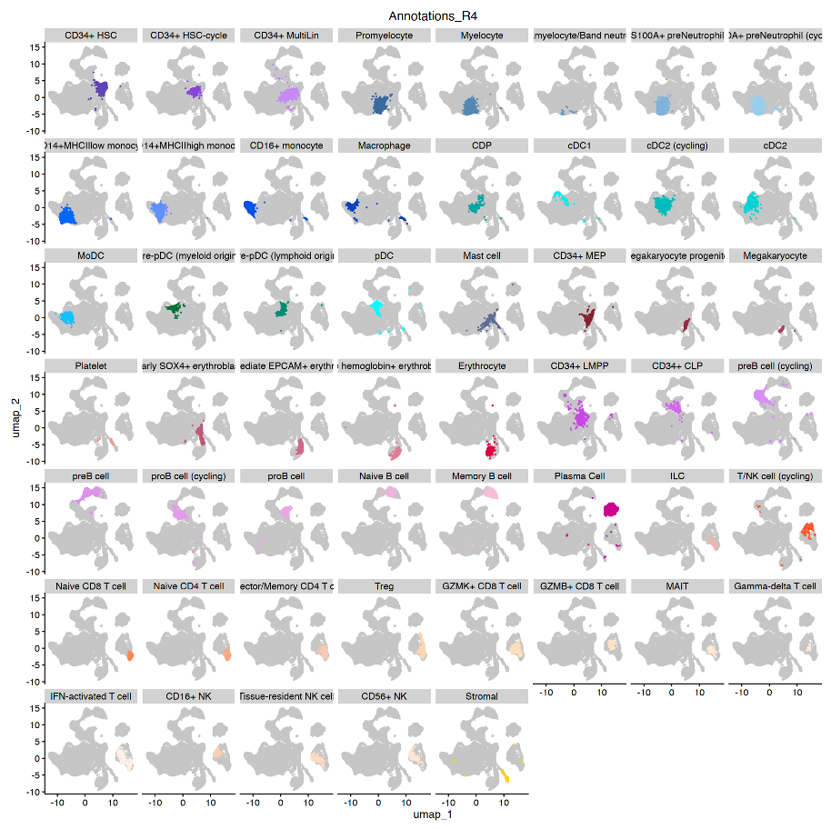

# AMLclassifier
Classifier for single cell data

Acute myeloid leukemia (AML) is an aggressive cancer of hematopoietic stem/progenitor cells originating in the bone marrow. Leukemic cells and their microenvironment are diverse, vary across patients, and may be clinically quite relevant. Single-cell RNA sequencing (scRNAseq) is increasingly used to unbiasedly characterize patient-derived AML cells to address a variety of biological questions. Annotations of these cells rely on expert-based curations which are time-consuming and not generalizable. Additionally, AML cells are continuous and could be a mixture of categories, making it difficult to annotate specifically in-between cell types. There is thus an important need for an accurate and automated method to annotate the diverse cell types of normal hematopoietic cells and in AML. We tested different machine learning algorithms using re-processed raw data from Human Cell Atlas bone marrow scRNA-seq dataset (8 donors, 220K cells). An extensive annotation effort was deployed using both previous annotations1,2 released for this dataset (each with strengths and limitations) and expert curation by our group. A subset of the reannotated cohort was used for training and validation of machine learning algorithms. Artificial neural network (ANN) offered an excellent accuracy and was selected. Its performance was validated on an independent AML dataset comprising 15K curated AML cells (Van Galen et al, Cell 2019). With our classifier users don’t need to provide an annotated reference, as with other published algorithms (e.g., Seurat Label transfer). A tutorial for using this classifier is provided under Classifier jupyter notebook for both R (Seurat) and Python (Scanpy) data

Overview of the process:

1- Reprocessing of HCA data
Data preprocessing: 
We took the 10X single cell RNA-seq FASTQ files from immune cell atlas of human hematopoietic system(4). There are 284 FASTQ files from 8 donors, 9 flow cells per donor in this reference. Each flow cell sample was run through Cell Ranger V5(5), which produces filtered/unfiltered matrix of gene counts per sample. We used the filtered matrices to create 72 Objects. These were combined, normalized to create one final object containing all the donors and flow cells (226148 cells). Annotation from Hay et. al(1) and DISCO(2) paper were added to cells. However, they don’t cover all the cells, due to difference of Cell Ranger pipelines and references used.

Filtering & integration:
We first, filtered cells with high percentage of Mitochondria genes which removed 7992 cells, resulting in 218156 cells. Doublet scores was calculated using scDblFinder package(6).

We then, created UMAP of data and divided the UMAP into five groups: main cluster (will cells from HSC-like to myeloid and Erythroblast, T/NK cells, B cells, plasma and Stromal cells).
For each group, we removed clusters with doublet scores well above the rest of cells, cluster with mean log (doublet score) of one and above. We also manually explored cluster with feature levels well below the rest (below 630 features), and for these clusters, the decision was made to either keep, removed the whole cluster or remove cells with less than 500 features. We end up with 195414 high quality cells, which were, then, integrated using Harmony(3).

Annotation:
HSC-like, progenitors, plasma, stromal and platelet cell-types were taken from Hay et. al(1) and the rest of cell-types were taken from DISCO(2) to acquire the desired granularity. Any cells from DISCO that was in Hay et.al group was assigned to NA, this resulted in 137707 annotated cells and 57702 NA cells. 

To recover NA cells, we used their nearest neighbors, we tested up to 25 K (number of nearest neighbors to use) for finding the optimal number of neighbors.
For testing the optimal K to use, we randomly assigned at least 10% of cells per cell-type to NA and used their (K= 3 to 25) neighbors to predict their cell-type. Cells that did not have any annotated neighbor, were annotated based on the most abundant cell-type present in their cluster. We iterated this process 25 times and chose K=15 as the most optimal number for how many nearest neighbors to use.

Using K=15, we annotated 53633 cells and remaining 4069 cells were annotated based on their cluster’s most abundant cell-type.

Final processing and reference data for classifier:
We, then explored each cell-type individually and did a second round of filtering of cells (Megakaryocytes, pre-pDC, Intermediate EPCAM+ erythroblast, and Monocyte MHCIIHigh) that were clearly outside of their main clusters. This resulted in 195020 cells in our final object. We then created a subset object with 3000 cells per cell-types except for T/NK/Erythro cells where we picked around 750 cells per each of their sub categories (64326 cells). We also identified some cells in-between monocyte and cDC2 cells, which for now we have classified as MoDC. This is the final object used for training the classifier.

2- Training of the classifier
We used artificial neural network algorithm as it does a great job learning cell-types based on gene-expressions. ANN was trained using various parameters in our reference dataset containing 64326 cells and 36601 genes and it was able to recognize our desired cell-types. Our current ANN version is developed by MLPClassifier package of seaborn library in python, with 350 hidden layers, RelU activation, stochastic gradient descent weight optimization. The classifier model is named ANNClassifier.sav and the features used for it is in ANNClassifier_features.txt

3- Applying the classifier
The Jupyter notebook Classifier (in R and Python) are simple tutorials for loading the classifier and applying it per sample.

Reference:
1-	Hay et. al, Experimental Hematology, 2018
2-	Li, Mengwei, et al. Nucleic acids research, 2022
3-	Korsunsky, I., et al. Nat Methods, 2019 
4-	https://explore.data.humancellatlas.org/projects/cc95ff89-2e68-4a08-a234-480eca21ce79
5-	https://support.10xgenomics.com/single-cell-gene-expression/software/pipelines/5.0/algorithms/overview
6-	https://bioconductor.org/packages/devel/bioc/vignettes/scDblFinder/inst/doc/scDblFinder.html

